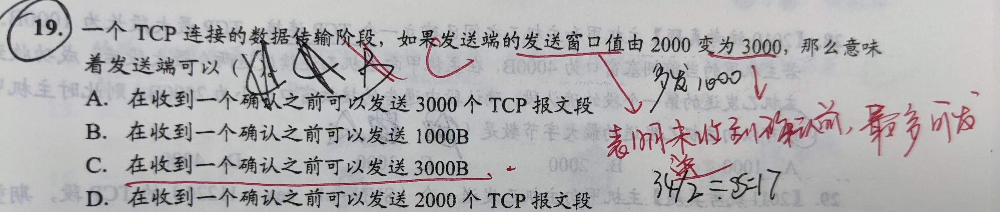
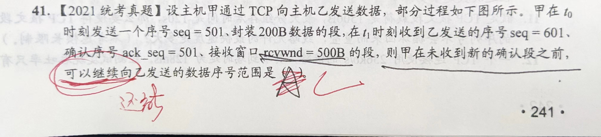
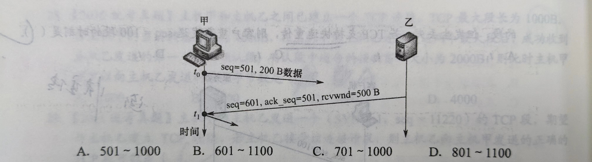
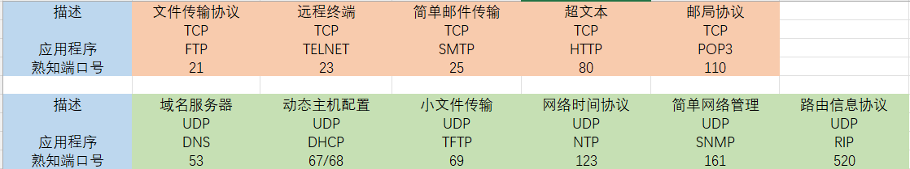

# 第五章 传输层

## 一、服务

```
    传输层向上层(应用层)提供通信服务；
    为进程之间（端到端）提供逻辑通信
    主机的协议栈才有 传输层和应用层；路由器只有下三层
```

### 1.1 功能

1. 端到端的通信

2. 复用和分用（网络层也有）

3. 差错检测（首部 & 数据部分）（网络层只检查IP首部）

4. TCP & UDP 两种传输协议 （同时提供，网络层只提供面向连接或无连接一种）
   
   ### 1.2 寻址 & 端口
   
   #### 1.2.1 数据链路层寻址
   
   MAC地址-SAP
   
   #### 1.2.2 网络层寻址
   
   IP地址-SAP
   
   #### 1.2.3 传输层寻址
   
   套接字:= <IP地址:端口号>
   套接字用来标识网络中某台主机上的某个应用程序
   
   ##### 端口-SAP
   
   端口是传输层的服务访问点(SAP)
   
   ##### 常见端口号
- 16bit
  服务器端口号

- 熟知端口号(0~1023)

| 描述    | 文件传输协议 | 远程终端   | 简单邮件传输 | 域名服务器  | 动态主机配置 | 小文件传输 | 超文本  |
| ----- | ------ | ------ | ------ | ------ | ------ | ----- | ---- |
|       | TCP    | TCP    | TCP    | UDP    | UDP    | UDP   | TCP  |
| 应用程序  | FTP    | TELNET | SMTP   | DNS    | DHCP   | TFTP  | HTTP |
| 熟知端口号 | 21     | 23     | 25     | 53     | 67/68  | 69    | 80   |
|       |        |        |        |        |        |       |      |
| 描述    | 邮局协议   | 网络时间协议 | 简单网络管理 | 路由信息协议 |        |       |      |
|       | TCP    | UDP    | UDP    | UDP    |        |       |      |
| 应用程序  | POP3   | NTP    | SNMP   | RIP    |        |       |      |
| 熟知端口号 | 110    | 123    | 161    | 520    |        |       |      |

- 登记端口号(1024~49151)

- 客户端使用的端口号(49152~65535)：应用程序使用的端口号；临时端口号

### 1.3 无连接 & 面向连接服务

#### 1.3.1 无连接-UDP

- UDP-无连接非可靠的传输层协议

- 采用UDP，传输层向上提供一条不可靠的逻辑信道

- 多路复用、差错检查

- 简单、快速、实时性好

- TFTP、DNS、SNMP、RTP(实时传输协议)

#### 1.3.2 面向连接-TCP

- TCP-面向连接的可靠传输服务

- 采用TCP，传输层向上提供一条**全双工可靠**的逻辑信道

- 建立连接-传输数据-释放连接

- 不提供广播/组播服务

- 提供确认、流量控制、报文超时计时器、连接管理

- FTP、HTTP、TELNET

- 多路复用、差错检查

#### 【习题】

1. 可靠传输协议中的 **“可靠”** 指的是：使用**确认机制**来确保传输的数据不丢失

## 二、UDP

### 1.1 服务

#### 复用和分用 & 差错检测

### 1.2 UDP优点

1. 无须建立连接 ( 没有建立连接的时延 )

2. 无连接状态 (TCP需要维护连接状态，如收发缓存，窗口值，序号，确认号...)

3. 分组首部开销小；8B

4. 应用层更好的控制发送的数据和发送时间；UDP没有拥塞控制，发生拥塞时，不会影响发送效率，实时性好；【实时性-UDP；可靠性-TCP】

5. 支持一对一、一对多、多对一、多对多交互通信【视频会议】

### 1.3 UDP特点

1. 少量数据传输【DNS，SNMP，TFTP】

2. 多媒体应用

3. 不可靠【可靠性由应用层完成】

4. 面向报文【在传输层不对UDP数据报进行分片，即**UDP数据报不可分割**，在网络层，如果一个装在UDP的IP分组过大，仍然是会对该IP分组进行分片】

### 1.4 首部格式


**8B,各字段均2B**

1. 源端口：**回信时使用，不需要可填0**

2. 目的端口：交付

3. 长度：首部+数据部分总长度

4. 检验和：检验首部和数据部分

### 1.5 UDP校验

#### 1.3.1 伪首部


**伪首部长度：12B**

**包含IP地址 （就是网络层的ip地址）**

**协议字段：17-UDP；6-TCP**

UDP长度

#### 1.3.2 校验和计算

发送端计算：

1. 校验和:=0

2. 添加伪首部

3. UDP报文段( 数据部分 )非偶数字节时，末尾添0

4. 二进制反码运算求和（循环加法，最高位有进位溢出时，加到最低位）

5. 计算结果填入校验和

接收端检验：

计算后结果为 全1，则表示无差错

## 三、TCP

### 1.1 特点

- 在传输层实现可靠传输【传输的可靠、有序、无丢失、不重复】

- 面向连接的逻辑链接

- 一条TCP连接只有两个端点【端到端~进程到进程】

- 全双工【收发双方设有缓存】

```
发送缓存：
1.准备发送的数据
2.已发送但未收到确认的数据
接收缓存：
1.按序到达但未被接受应用程序读取的数据
2.不按需到达的数据
```

- **面向字节流**，**传送单元也为报文段**【UDP面向报文段】

- 发送长度=min{rwnd, cwnd}【UDP发送长度由应用程序决定】

### 1.2 首部格式


| 协议  | 固定长度 | 可变长度        | 范围      |
| --- | ---- | ----------- | ------- |
| IP  | 20 B | 40 B (可选字段) | 20~60 B |
| TCP | 20 B | 40 B (选项)   | 20~60 B |
| UDP | 8 B  |             | 8 B     |

1. 源端口、目的端口：复用，分用都通过端口实现

2. 序号：**每个字节按顺序编号，一个TCP报文首部序号字段的值是数据部分第一个字节的序号【报文段的序号】**

3. 确认号：期望收到对方下一个报文段的序号

4. 数据偏移：首部长度，单位 4B【与IP首部长度字段一样】

5. 保留：以后使用，目前全置0

6. 紧急位URG：=1，紧急字段有效，表明数据部分含有紧急数据，高优先级发送

7. 紧急指针：URG=1时，数据部分第一个字节到紧急指针所指的字节部分为紧急数据

8. **确认位ACK**：=1，确认号有效，建立连接后，ACK必须置为1

9. 推送位PSH：=1，尽快上交给应用程序，不必等待缓存区填满后上交

10. 复位位RST：=1，表明TCP连接出现严重差错，必须释放连接，重新建立连接

11. **同步位SYN**：=1，连接建立请求 / 连接接受报文；

```
SYN=1,ACK=0 连接请求报文  请求建立连接
SYN=1,ACK=1 连接确认响应报文  同意建立连接
```

12. **终止位FIN**：用来释放连接【在四次挥手处详解报文】

13. 窗口：允许发送方发送的数据量【字节】，也是发送方未收到确认前，可以发送的最大字节数【注意区分“**可以继续**”，“**还可以**”，等题目字眼】

14. 校验和：伪首部协议字段位6-TCP，其余与UDP一致

15. 选项：首部长度可变部分；eg：MSS(规定数据部分的最大报文长度)

16. 填充：使首部长度位 4 B 的整数倍

### 1.3 连接管理

TCP连接的三个阶段：建立连接-数据传送-释放连接

建立端到端(进程到进程，**套接字到套接字**)的逻辑连接

建立过程中主要解决一下问题：

1. 确知对方存在

2. 协商参数【最大窗口值，是否使用选项，服务质量...】

3. 对实体资源进行分配【缓存大小...】

TCP连接采用C/S模式

#### 1.3.1 连接建立 - 三次握手


1. SYN=1,请求连接报文，**不携带数据，消耗序号**，进入 SYN-SCENT（同步已发送）

2. SYN=1,ACK=1 请求连接确认报文，服务器对TCP连接分配缓存和变量，**不携带数据，消耗序号**，TCP服务器进入 SYN-RCVD（同步收到）

3. ACK=1 确认接受响应报文，客户端为TCP连接分配缓存和变量，**可以携带数据，若不携带数据，则不消耗序号**，进入 ESTABLISHED（已建立连接）

##### 【为什么要三次握手？而不两次】

防止已失效的连接请求突然又传送到服务器上产生差错。

A向B发送连接请求，因报文1在某个结点长时间滞留，导致超时，A认为该报文1丢失后，A重新发送一个请求连接报文2，这个报文2正常到达B，建立连接后传输数据完毕，断开连接。此时已失效的请求报文1传到B。

若采用两次握手：B认为A在请求建立连接，B发回确认报文，则认为连接以建立完成，但实际上A没有建立连接请求，导致B一致处于等待接受数据的状态，浪费服务器资源

采用三次握手：B发回确认报文后，由于是失效的请求报文，A不予理睬(已经关闭连接了)，B处计时器超时后没有收到A的响应确认报文，则连接建立失败。

#### 1.3.2 连接释放 - 四次挥手


1. FIN=1,seq=u 关闭连接请求，且u-1之前的数据(包括u-1)全部传输完成，**FIN报文可以携带数据，要消耗序号**，进入 FIN-WAIT-1（终止等待1）

2. ACK=1 确认报文，服务端进入 CLOSE-WAIT（关闭等待），客户端收到后进入 FIN-WAIT-2（终止等待2）

【TCP是全双工，所以要双向进行断开，一方断开，另一方仍可以传输】

1. FIN=1,seq=w,ack=u+1 关闭连接请求，seq=w 可能半关闭的服务器又传输了数据，服务器进入 LAST-ACK（最后确认），客户端收到后，进入TIME-WAIT（等待时间计时器设置的时间）

2. ACK=1,seq=u+1 确认报文，经过 2MSL（最长报文段寿命）【RFC793建议为2分钟】，客户机进入 CLOSED（连接关闭）

##### 【为什么要四次挥手且要等待2MSL？】

1. TCP是全双工通信【四次挥手】

2. 保证A发送的最后一个报文段能够到达B。若不等待2MSL，当A最后的确认报文丢失时，此时A已关闭，不能重传，但B尚未关闭，TCP连接将保持此半连接状态

3. 防止出现“已失效的连接请求报文”，等待2MSL能够保证本连接持续时间内所产生的所有报文段从网络中消失。若不等待，可能出现双方都关闭了，但服务端又收到已失效的连接请求，客户端服务端双方都要对这个失效报文进行处理，浪费资源

##### 【可以三次挥手吗？】

可以。当客户段请求关闭连接时，服务端也完成了数据发送和处理，同时也要关闭连接，此时可以将 2，3次的ACK，FIN报文何在一起发送

### 1.4 可靠传输

TCP使用 校验、序号、确认、重传等机制实现可靠传输

###### 1. 校验

除了伪首部协议字段为6-TCP（17-UDP）外，其余与UDP一致

###### 2. 序号

**保证有序的交付**

**每个字节编上序号**，报文段首部序号字段值为数据部分第一个字节的序号

###### 3. 确认号

确认号，期望收到对方的下一个报文段的第一个字节的序号。

**累计确认制**，只确认数据流中至第一个丢失字节为止的字节。如发送方发送报文段1，2，3，接收端收到1，3，此时只对报文段1进行确认，确认号仍是2

发送方会缓存已发送但未收到确认的字节，以便需要时进行重传

###### 4. 重传（超时 & 冗余ACK）

1. 超时重传

```
为发送的每一个报文段设置一次计时器，超时仍未收到确认时，需要重传该报文
当发生重传时，不再选择RTT作为超时时间，而将计算RTO作为超时重传时间
```

重传时，RTO的计算：

平滑往返时间（RTTs）：$新的RTT_{S} =(1-\alpha )\times (旧的RTT_{S})+\alpha \times (新的RTT样本)【首次RTT_{S}=RTT】$

RTT偏差加权平均值（RTTd）:$新的RTT_{D}=(1-\beta )\times (旧的RTT_{D})+\beta \times \left | RTT_{S}-新的RTT样本 \right |【首次RTT_{D}=RTT/2】 $

超时重传时间RTO：$RTO=RTT_{S}+4\times RTT_{D} $

2. 冗余ACK

```
解决超时重传周期太长的弊端
TCP规定每当比期望序号大的失序报文段到达时，就发送一个冗余ACK，指明下一个期待字节的序号
三个连续冗余ACK-快重传

如：
发送方发送了 1，2，3，4，5个报文段
接收方收到了1，发送对报文1的确认报文 ACK=1 ack=2
接收方收到3，4，5时，并非报文2，所以接收方又发送三个对报文1的确认报文，即ACK=1，ack=2
当发送方连续收到三个冗余的确认报文时，则认为，跟在自己后面的那个报文丢失了，需要重传
即三个连续的冗余ACK=1 ack=2 报文，则表示报文2需要重传

p.s:ACK=1，ack=2 的报文总共传了4次
```

### 1.5 流量控制

**接收窗口rwnd**: **接收方**根据自己接收缓存的大小，**动态的调整发送方的发送窗口**的大小。

**拥塞窗口cwnd**: **发送方自己**根据网络的拥塞状况的估计确定的窗口值。

**发送方的发送窗口 = min{rwnd, cwnd}**

###### 传输层与数据链路层流量控制的区别

传输层定义端到端之间的流量控制；数据链路层是点到点

传输层的窗口大小是动态可变的；数据链路层的窗口大小则不能动态变化

### 1.6 拥塞控制

###### 发送方的发送窗口 = min{rwnd, cwnd}

##### 流量控制与拥塞控制区别

- 拥塞控制是让网络能够承受现有的网络负荷，是一个全局性的过程，涉及所有主机、路由器、以及降低网络传输性能有关的因素

- 流量控制是指点对点的通信量的控制，是接收端与发送端的问题，主要做的事是控制发送端的发送速率

- 流量控制中，发送方的发送的数据量由接收方决定；拥塞控制中，则有发送方自己通过检测网络状况来决定

#### 1.6.1 慢开始 & 拥塞避免

##### 1. 慢开始算法【指数倍数增长】

从初始值开始，**以2的倍数增长**到阈值( sstrength )，达到阈值时，采用拥塞避免算法

例如 cwnd = 1, 2, 4, 8, 16 ...

**单位是MSS**

##### 2.拥塞避免算法【加法增长】

**每次窗口值+1**  【同样也是1个MSS】

##### 3.发生拥塞的处理

$拥塞处理过程 = \left\{\begin{matrix}sstrength = max\left \{2,\frac{cwnd}{2}    \right \} 
  & ...... 1\\cwnd=1
  & ...... 2\\慢开始算法
  & ...... 3
\end{matrix}\right.$ 

#### 1.6.2 快重传 & 快恢复

##### 1.快重传

发送方**连续收到 3 个重复的ACK报文**，直接重传对方尚未收到的报文段，不必等待该报文段设置的重传计时器超时【不包含正常情况下的确认ACK报文】

##### 2.快恢复

$ 收到连续3个冗余ACK = \left\{\begin{matrix}sstrength = max\left \{2,\frac{cwnd}{2} \right \}
  & ...... 1\\cwnd=sstrength
  & .diff. 2 \\拥塞避免算法
  & ..... 3
\end{matrix}\right. $

#### 【两者比较】


#### 【习题】

1. 流量控制中，窗口值类型题目的一些关键字眼：**“还”**，**“可以继续”**

2. 滑动窗口就是，发送方收到确认报文后，发送窗口就可以向后滑动，相当于发送缓存释放已经确认的报文缓存，还，可以继续，等字眼就是在发送缓存由部分占用的情况下还能发多少B

例如：



没有上述字眼，则就是窗口值大小





## 四、传输层协议



## 五、本章小结

### 1. MSS (Maximum Segment Size) 大小

MSS的大小设置于接收方缓存大小无关

于网络利用率、网络开销等相关

若设置太小，极端情况下，网络利用率很低

若设置太大，网络层IP数据报分片后出现差错，重传开销大

### 2.如何判定确认报文是对原报文段还是重传报文段的确认

重传时，不再采用RTT作为计时器,而是

RTO计时器来区分，没重传一次，该报文的RTO就增大一些

采用Karn算法

### 3.TCP重传机制是GBN还是SR？

类似两者的混合体

TCP采用**累积确认**【类似GBN】，**缓存正确到达但失序的报文**【类似SR】。例如一组报文段中，第N个报文段丢失了，但第N+1个之后的报文都按序正常接受，TCP至多重传一个报文，即只重传报文N，后续处理这些失序的报文段【怎样处理失序的报文段，TCP没给出要求】

### 4.超时cwnd设为1，连续3个ACK cwnd减半？

发生超时，说明网络拥塞情况已经相当严重了，可能连ACK都没法正常接发

连续3个ACK说明网络情况比超时要好一些，至少还能发送连续的3个ACK

### 5.只有TCP才需要计算往返时间RTT

TCP根据RTT来设置报文的超时计时器

UDP则不需要

所以所，传输层中只有TCP需要计算往返时间

### 6.TCP建立连接时要确保每一次使用的序号在之前的网络中没有出现过

即，我这次连接使用的序号，**不会出现网络中有残留报文序号在此次连接使用的序号范围之内**

### 7.假定链路不会出现差错，结点不会出现故障，TCP的可靠交付是否多余？

Nope

可能存在一下情况，仍需要TCP的可靠交付

1. IP数据报独立选择路由，交付主机时可能出现失序

2. 路由计算出错，导致TTL下降为0，该IP数据报丢失

3. 某路由通信量突然高涨，导致路由器来不及处理，该IP数据报被丢弃 
