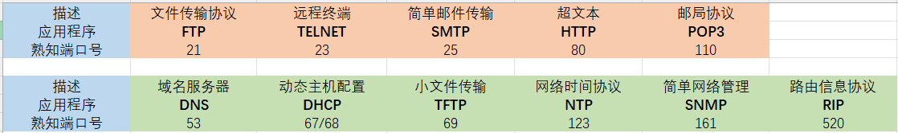
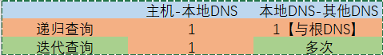

# 第六章 应用层

## 一、网络应用模型

### 1.C/S 客户/服务器模型

1. 服务器**被动**接受请求；客户端主动发出请求

2. **客户端需要知道服务器的地址；服务端无需知道客户端的地址**

3. 网络的管理工作由少数服务器承担，网络的管理非常集中方便

4. **客户机项目之间不直接进行通信**

5. 客户机相对简单，不需要复杂的硬件和操作系统

6. 可拓展性差，由于资源的局限，服务器可支持的客户机数量有限

7. Web、FTP、电子邮件、远程登录

### 2.P2P模型

P2P模型的思想是整个网络中的传输内容不再被保存在中心服务器上，每个结点同时具有下载、上传的功能，其权力和义务都是大体对等的

1. 每个结点既做服务端也做客户端

2. 任务分配到各节点上，减轻服务器压力，提高系统效率和资源利用率

3. 客户机之间可**直接共享**文档

4. 可拓展性好

5. 健壮性强

6. 占用结点端资源较多，影响结点性能

7. 大量使用造成网络拥塞

## 二、域名系统DNS

域名系统将具有特定含义的主机名转换为IP地址【不是一一对应的关系】

- 主域名服务器、辅助域名服务器都有域名数据库

- 一个域名有且仅有一个主域名服务器

- UDP-53

### 1.层次域名空间

顶级域【com】、二级域【baidu】、三级域【www】

**顶级域名**

- 国家/地区顶级域名 .cn .us .hk .jp

- 通用顶级域名 .com .net .edu .org

- 基础结构域名 .arpa 【用于反向域名解析】

### 2.域名服务器

联机分布式的数据库系统，C/S模型

域名服务器中包含域名到IP的映射，还有连向其他域名服务器的信息

⚠**每个域名服务器都维护了一个高速缓存，存放的每项域名映射都具有在缓存中的存在期，即每项内容并不是一直存在，而是有计时器**

#### 本地域名服务器

被查找时，若本地服务器中含有，则直接给出；否则本地服务器向跟服务器请求查找

#### 根域名服务器

知道所有顶级域名服务器的IP地址

被查找时一般不直接给出映射，而是指向下一个顶级域名服务器

#### 顶级域名服务器【.xyz.com】

被查找时可能给出域名到IP的映射，也可能指出下一步应查找的授权域名服务器的IP地址

#### 授权/权限域名服务器【.abc】

总能给出域名到IP地址的映射

### 3.两种域名解析方式

#### 递归解析

本地域名服务器只向根域名服务器请求查询一次；后续将在DNS服务器内递归查询，最后并从根服务器返回结果【根服务器负载大，现实几乎不使用】

#### 迭代解析

本地域名服务器直接与根服务器、顶级服务器或授权服务器进行交互；例如根服务器告诉本地服务器应该找.com顶级服务器，则本地服务器就向.com顶级域名服务器进行查询请求

【注】：主机到本地域名服务器的查询均是递归查询

### 【习题】

当主机缓存中含有该映射------0次

主机发起查询：本地DNS-->根DNS->顶级DNS【.xyz.com】->授权DNS【abc】------4次

## 三、文件传输协议FTP

### 1.功能

- 不同主机系统之间的文件传输

- 用户权限管理-提供远程文件管理

- 匿名FTP-提供公用文件共享【匿名FTP用户名-anonymous】

- 不适用两个计算机之间共享文件【采用SMB】

- C/S模式

- **控制端口21；数据连接端口20**

### 2.两项连接：控制连接 & 数据连接

**控制连接**

用来传送控制信息：暂停、开始命令，**连接请求**，**传送请求**，7位ASCII码传送，会话期间一致保持打开状态

**数据连接**

传送完毕后会关闭数据连接

主动模式PORT：建立连接后，读取数据时，客户端随机开放一个端口，并把PORT命令与该端口号发送给FTP服务器，客户端使用该端口存取数据【服务器连接到客户端指定的端口】

被动模式PASV：建立连接后，读取数据时，客户端发送PASV命令，服务器将随机在本地选择开放一个端口，并告知客户端，客户端使用该端口存取数据【客户端使用服务器在本地选择的端口】

## 四、电子邮件

### 1.简介

- 异步通信方式

- 用户代理UA：用户与电子邮件系统的接口；显示，编辑窗口...

- 邮件服务器：发送&接收邮件，C/S模式，同时充当客户端和服务端

- 邮件发送协议和读取协议

### 2.邮件格式

- To - 必填

- From - 必填

- Subject - 可选

### 3.MIME 多用途网际邮件扩充

Multipurpose Internet Mail Extensions

MIME拓展了SMTP，并未改变邮件格式，但增加了邮件主体结构

使得邮件支持传送可执行文件以及**二进制对象**

**SMTP只支持传送7比特ASCII码-明文**

### 4.SMTP & POP3

#### SMTP-发送邮件

简单邮件传输协议 - Simple Mail Transfer Protocol 

TCP-25

主机发送给邮件服务器

邮件服务器发送给邮件服务器

**三个阶段**

1. 建立连接【不适用中间邮件服务器，TCP连接在接收方两端直接建立连接，不管相隔多远，相距多少路由器】

2. 邮件传送

3. 释放连接

#### POP3 & IMAP - 读取邮件

**POP3**

Post Office Protocol 邮局协议-邮件读取协议

邮件服务器的邮件拉取到本地

C/S-TCP-110

POP两种读取方式：下载并保留、下载并删除

**IMAP**

更复杂，支持创建文件夹、移动邮件等联机命令

允许读取邮件的某一部分

### 5.HTTP邮件

Hotmail, Gmail等这类

用户与邮件服务器之间的接受和发送使用的是 HTTP

但在不同邮件服务器之间仍是使用SMTP

## 五、万维网WWW

#### WWW不是一种协议，而是一种服务

- WWW是分布式、联机式的信息存储空间

- 使用URL（同一资源定位符）标志每一样资源

- 资源使用HTTP（超文本传输协议）传送给用户

- 使用HTML（超文本标记语言）的超链接方便的从一个站点跳转到另一个站点

#### HTTP

面向事务的应用层协议

规定浏览器与服务器之间请求与响应的**格式和规则**

**1.特点**

**使用TCP，面向连接的协议**，但HTTP不考虑数据丢失后的重传问题

**HTTP本身无连接**，早期版本的HTTP，每次只处理一个请求，完成后立即断开连接

**HTTP无状态**【采用Cookie、Session来记录用户的行为状态】

HTTP/1.0非持久连接【Connection: Close】【每个资源单独使用一次TCP连接传送】

HTTP/1.1开始支持 持久连接【Connection: Keep-alive】【又分流水线与非流水线】

**2.报文结构**

HEAD不返回请求对象，作用主要是调试
