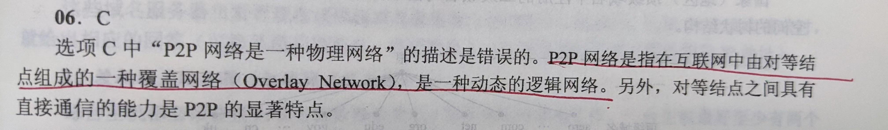

# 第六章 应用层

## 一、网络应用模型

### 1.C/S 客户/服务器模型

1. 服务器**被动**接受请求；客户端主动发出请求

2. **客户端需要知道服务器的地址；服务端无需知道客户端的地址**

3. 网络的管理工作由少数服务器承担，网络的管理非常集中方便

4. **客户机项目之间不直接进行通信**

5. 客户机相对简单，不需要复杂的硬件和操作系统

6. 可拓展性差，由于资源的局限，服务器可支持的客户机数量有限

7. Web、FTP、电子邮件、远程登录

### 2.P2P模型

P2P模型的思想是整个网络中的传输内容不再被保存在中心服务器上，每个结点同时具有下载、上传的功能，其权力和义务都是大体对等的

1. 每个结点既做服务端也做客户端

2. 任务分配到各节点上，减轻服务器压力，提高系统效率和资源利用率

3. 客户机之间可**直接共享**文档

4. 可拓展性好

5. 健壮性强

6. 占用结点端资源较多，影响结点性能

7. 大量使用造成网络拥塞

## 二、域名系统DNS

## 三、文件传输协议FTP

## 四、电子邮件

## 五、万维网WWW
