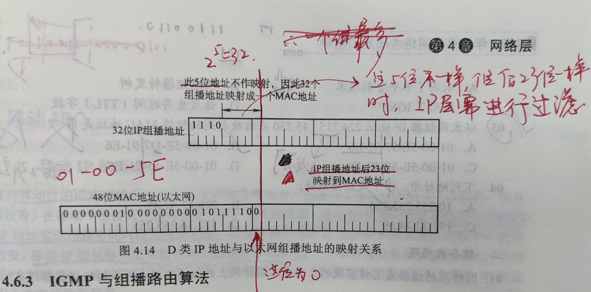

# 第四章 网络层

## 一、功能

**无连接、不可靠的服务**

网络层向上提供简单灵活的、无连接的、尽最大努力交付的数据报服务。

端到端（进程之间）的可靠服务由上层传输层来提供

### 1.异构网络互联

**异构**网络 (Heterogeneous Network）是一种类型的网络，其是由*不同制造商生产的计算机*， *网络设备 和系统组成的*，大部分情况下运行在不同的协议上支持不同的功能或应用。（对应层次使用的设备，协议，数据单元格式，转发机制...不同）

**网络互联**一般指的是：使用路由器进行网络互联和路由选择

【王道p143-04】多个局域网互联，要求物理层、数据链路层、网络层协议可以不同(例如 Ipv4, Ipv6互联)，而网络层以上的高层协议必须相同

### 2.路由与转发

路由器的两个功能：路由 & 转发

路由选择：（选择哪一条路走）

分组转发：（选择哪一个端口转发）

### 3.拥塞控制

**拥塞**：出现过量分组而引起网络性能下降的现象（当分组多了，网络的吞吐量骤降）

**拥塞控制的两种方法**：

1. **开环控制**：静态的预防方法；事先考虑到所有可能引起拥塞的因素；系统启动后，按照既定的规则接受与丢弃分组，不考虑当前网络的状况；
2. **闭环控制**：动态；不考虑任何因素，而采用监视网络状况，动态调整；基于反馈环路的概念

### 4.SDN基本概念

将网络层抽象划分为：数据层面（转发）和控制层面（路由选择）；

SDN（software define network）软件定义网络：集中式控制层面，分布式数据层面；网络的路由信息维护计算交由远程控制器，路由表下放给路由器，路由器只简单进行 接受、查询、转发

远程控制器掌握个主机和整个网络的状态，为每个分组计算出最佳路由，通过Openflow协议（或其他）将转发表(SDN中称为 流表)下发给路由器；

**优点**

1. 集中式控制，分布式高速转发
2. 可编程性
3. 成本低

**问题**

1. 安全风险，集中式管理的弊端
2. 规模扩大后，控制器的瓶颈问题

## 二、IPv4

### 1 IPv4分组

#### 1.1 IPv4分组格式


**IPv4分组=首部（固定+可变）+数据部分**

**首部：20-60 B**

**固定长度：20B**

##### 字段含义

1. 版本：ipv4 或 ipv6版本
2. 首部长度：**单位 4B**，所以值为5，则首部长度为20B
3. 总长度：整个数据报(首部+数据)的长度，**单位 1B**，但传输时，数据链路层MTU的有限制，所以需要分片
4. 标识：用于表示分片后的各片来自同一个Ip数据报
5. 标志：3位，最高位没有表示，从低到高为 MF（More Fragment，仍有分片）DF(Don't Fragment，不能分片)，注意何时允许分片，是否最后一个分片
6. 片偏移：**单位 8B** ，表示各片在原分组中的起始位置(原分组位置=fragment offset*8B)，**!!!除最后一个分片外，其余每个分片的长度一定是8的整数倍 **(**注意，小坑**)
7. 生存时间(TTL)：在路由器与主机之间的跳数
8. 协议：该分组的数据部分使用何种协议( TCP? UDP?)，也是交付时应当上交给哪种协议处理
9. 首部校验和：只检验首部部分
10. 源地址：IP地址，32bit=4B
11. 目的地址

#### 1.2 IP数据报分片

|     | 0         | 1    |
|:---:|:---------:|:----:|
| DF  | 可以分片      | 不能分片 |
| MF  | 没有分片,最后一个 | 还有分片 |

**【2021统考】**若路由器向 MTU=800 B 的链路转发一个总长度为 1580 B 的 IP 数据报（首部长度为 20 B）时，进行了分片，且每个分片尽可能大，则第 2 个分片的总长度字段和 MF 标志位的值分别是：


### 2.IPv4地址与NAT

#### 2.1 传统分类的IPv4地址


**两段式IP地址：IP地址::={<网络号>, <主机号>}**

**注意各类IP地址的开头**：A类是0开头，B类是10开头，C类是110开头

##### 表格2解释

| **A类地址 最大可用网络数 -2** | **全0作为保留地址，网段127.*是环回自检地址**    |
| ------------------- | ------------------------------ |
| **最大主机数 -2**        | **主机号全0表示该网段；主机号全1表示该网段的广播地址** |

##### IP地址的一些注意点

1. **主机号全0**表示该网段（该网络）
2. **主机号全1**表示该网络的广播地址（直接广播地址）
3. **127.*** 这一个网段作为环回自检地址（Lookback Test），表示任意主机本身，作为目的地址时，该数据报不会从本机发到网络上，不会出现在网络上
4. **0.0.0.0** 表示本网络上的本主机，不可以作为目的地址，当主机不知到本身的ip地址时，可用此作为数据报的源地址
5. 255.255.255.255 表示整个 TCP/IP 网络的广播地址(受限广播地址)

##### 0.0.0.0 与 127.* 区别

    127.0.0.1 是用来表示本地回环地址 不过本地回环是指127开头的所有ip地址都指的是本地回环地址 所以只能说是127.0.0.1 属于本地回环地址的一个子集
    
    0.0.0.0 是用来表示表示本机任意的ipv4地址

##### IP地址特点

* 两部分组成，点分十进制
* 分等级的地址结构
* 路由器根据IP地址的网络号发送分组
* IP地址标志 一台主机或路由器的一个接口（路由器每个端口都有一个IP，这个ip一般是该网段下主机的默认网关(在该网段内如果找不到目的地址，则默认往该网关的方向发送)）
* 转发器(集线器)/桥接器(网桥) 连接的若干LAN仍同属于一个网络(广播域)；所以说路由器隔离广播域，是因为他连接的都是不同的网段
* 同一局域网上的路由器端口，主机，网络号一致

#### 2.2 网络地址转换 NAT

NAT将专有网络地址转换为公有地址(内外网的连接)

NAT实际上就是内外网< IP，端口 >的映射


路由器的端口映射设置

##### 私有IP地址(记忆)

私有IP地址(可重用地址)**只用于LAN，不用于WAN**


##### NAT 转换过程


1. 将IP数据报(s:10... d:128...)发送给装有NAT软件的路由器

2. 路由器进行私有地址与公有地址的映射转换(将源地址换成自己的IP地址)

3. 路由器收到公网的ip数据报，目的地址为路由器的ip

4. 进行ip地址映射，将路由器的地址改为私有地址

- 端口之间是一对一的关系，多个内网端口不能映射到同一个外网端口，否则起冲突；

* NAT表项是管理员手动添加的（没有那个自学习过程，路由器的管理页面就可以添加），如果NAT表里没有符合的映射规则，则该数据报将会被丢弃


### 3 子网划分、子网掩码、CIDR

#### 3.1 子网划分

* 子网划分**属于一个单位内部的事情**，对外仍表现为一个没有划分子网的网络；
* **从主机号借位作为子网号**，不改变原来的网络号，只是对主机号再划分；
* 三级的IP地址::={<网络号>, <子网号>, <主机号>}
* 传输过程：在网络中传输仍然先找网络号；到达该网络后，找子网号；最后交付给主机
* 最初规定**子网号**不能全0全1；但现在CIDR的使用子网号也可以全0全1，主要取决于路由器是否支持；
* 子网划分、CIDR **主机号**都不能全0全1
* 划分子网的好处：**减小广播域**

#### 3.2 子网掩码

采用子网掩码来表示对原网络的主机号的借位

用以区分对网络是否进行了子网划分，否则就不知道对A、B、C类网络是否有子网划分

现因特网规定，所有网络都需要使用子网掩码

同一个网段/子网下，子网掩码相同

#### 3.3 CIDR 无分类编制

无分类域间路由选择(Classless Inter-Domain Routing) CIDR，在变长子网划分的基础上，消除传统A、B、C类网络的划分，在软件支持下实现构造**超网**的一种IP地址划分方法

* CIDR消除了传统A、B、C类地址以及子网划分的概念
* 使用“网络前缀”代替子网络的概念
* IP::={<网络前缀>, <主机号>}
* “斜线记法”，IP地址/网络前缀所占的比特数
* "CIDR不使用子网"是指不指明地址中若干位作为子网网段，但分配到的CIDR地址块仍然可以对其划分子网，相应的网络前缀位数变化
* **超网(CIDR)**：集合多个同类互联网地址的一种方法
* **路由聚合(构成超网)**：网络前缀相同的**连续**IP地址组成CIDR地址块，一个CIDR地址块表示多个地址（将多个子网聚合成一个较大的子网）
* CIDR 地址块中的地址数目一定是 2 的整数次幂(包含全0，1)
* 实际上**全0全1 的主机号仍不使用**
* 查找路由表时，遵循**最长前缀匹配原则**，**线索二叉树**

#### 3.4 网络层转发分组过程

主机路由：为特定的IP地址指定一个路由进行转发；转发表中添加特定主机的完整IP地址

默认路由：0.0.0.0/0 ；当目的网络不在转发表中，选择此

注意：转发表/路由表只给出了下一跳应该往哪走，并不知道分组所经过的完整路径

##### 3.4.1 **IP地址，MAC地址在转发过程中的变化**


**在不同网络传送时(路由器转发时)，MAC地址会改变；**

**在网桥转发帧时，不改变MAC地址**

##### 3.4.2 网桥与路由器

```
网桥没有MAC地址，网桥对于主机来说等于是透明的，它的作用是完成不同类型子网的连接，当它收到来自某个网络的数据帧时，它会通过查表判断这个数据帧应该发往哪个子网，然后就将数据帧发往该子网，源地址还是源主机的地址没有改变。它的接口是不能访问的，端口接收到的数据帧中的目的地址并不是端口的地址而是目标主机的地址，端口只是等于一个传送数据帧的通道。
```

        网桥和路由器的区别主要体现在：
    
        1. 网桥只能连接两个逻辑相同的网络（它相当于一个二层交换机），而路由器可以连接不同网络；
    
            网桥就是把不同物理位置的机器组成一个大的局域网，连接的多个网络属于同一个局域网；
    
            网桥连接的两个网络在逻辑上属于同一个局域网，但可以是不同策略的网络，如以太网和令牌环网；
    
            路由器可以连接不同的网络，连接的网络之间可以说没什么关系，是独立的；
    
        2. 网桥基于 MAC 地址转发(数据链路层设备)，路由器基于 IP 转发(网络层设备)；
    
        3. 网桥不隔离广播，而路由器可以隔离广播；
    
        4. 网桥工作在链路层，路由器工作在网络层

#### 3.5 习题

CIDR划分网络有两种情况：**平均分配**，**变长分配**

[【2017年 题38】](https://www.bilibili.com/read/cv2408151/)若将网络21.3.0.0/16划分为128个规模相同的子网，则每个子网可分配的最大IP地址个数是:

 

【2019 统考】若将101.200.16.0/20划分为5个子网，则可能的最小子网的可分配IP地址数是（  ）。

A.126  B.254  C.510  D.1022


【2021 统考】


 

【2016统考真题】如下图所示，假设H1与H2的默认网关和子网掩码均分别配置为192. 168.3.1和255.255.255.128，H3和H4的默认网关和子网掩码均分别配置为192.168.3.254 和255.255.255.128，则下列现象中可能发生的是( C )。

A. H1不能与H2进行正常IP通信 B. H 2与H 4均不能访问Internet
C. H1不能与H3进行正常IP通信 D. H3不能与H4进行正常IP通信


从**子网掩码可知H1和H2处于同一网段，H3和H4处于同一网段，分别可以进行正常的IP通信**，A和D错误。
因为R2的E1接口的IP地址为192.168.3.254，而H2的默认网关为192.168.3.1，所以H2不能访问Internet，而H4的默认网关为192.168.3.254，所以H4可以正常访问Internet，B错误。
由H1、H2、H3和H4的**子网掩码可知H1、H2和H3、H4处于不同的网段**，**需通过路由器才能进行正常的IP通信**，而这时H1和H2的默认网关为192.168.3.1，但R2的E1接口的IP地址为192.168.3.254，无法进行通信，从而H1不能与H3进行正常的IP通信。C正确。

### 4 ARP、DHCP、ICMP

TCP/IP协议栈


* 网络层及以上使用IP地址；
* 路由转发只根据IP地址；
* 链路层只能看见MAC帧，根据MAC地址进行转发，转发时，MAC不断改变

#### 4.1 ARP(地址解析协议)

Address Resolution Protocol

**ARP：IP地址到MAC地址的映射**


* ARP看见了IP，工作在网络层；NAT看见了端口，工作在传输层

#### 4.2 DHCP(动态主机配置协议)

Dynastic Host Configuration Protocol，常用于**给主机动态分配IP地址**，即插即用的联网机制，自动获取IP地址

**DHCP是应用层协议，基于UDP，C/S模式工作**

DHCP分配给DHCP客户的IP地址是**临时的**，只能在**租用期**内使用，可以续租

DHCP服务端与客户端通过**广播方式**交互(客户端没有IP地址啊，so)


#### 4.3 ICMP(网际控制报文协议)

Internet Control Message Protocol，来让主机或路由器报告差错和异常情况

ICMP作为IP数据报的数据（即IP数据报的数据部分）

ICMP是IP层协议

两种报文：

##### ICMP差错报告报文

用于路径上路由器向源主机报告差错和异常情况

* 终点不可达：路由器或主机不能交付数据
* 源点抑制：发生拥塞
* 时间超过：TTL为0，但未达终点     -    Tracert/Traceroute （跟踪分组经过的路由，工作在网络层）
* 参数问题：收到的报文 首部字段 存在错误
* 改变路由（重定向）：让主机选择更好的路由路径

##### ICMP询问报文

* 回送请求和回答报文    -    PING(测试两主机的连通性，工作在应用层，直接使用网络层的 ICMP，未使用传输层的TCP/UDP)
* 时间戳请求和回答报文
* 地址掩码请求和回答报文
* 路由器询问和通告报文

##### 不发送IMCP报文的几种数据报

1. ICMP差错报文，此数据报发生差错时

2. 第一个分片的后续数据报片

3. 组播地址的数据报

4. 含有特殊地址(127.0.0.0 / 0.0.0.0)

## 三、IPv6

### [ipv6 介绍](https://blog.csdn.net/weixin_44164489/article/details/108512354)


解决地址耗尽的措施

1. CIDR

2. NAT地址转换

3. 更大的地址空间IPv6 ( 根本上解决 )

### IPv6特点

1. 更大的地址空间；**128位**，16 B 是ipv4地址的平方，**根本解决地址耗尽问题**

2. 拓展的地址层次结构：**首部长度固定( 40B )**，将拓展首部放在有效载荷，所以一般说首部是固定的，也**没有首部长度字段**

3. 灵活的首部格式（**改进首部**），快速处理/转发

4. **即插即用**，自动配置，不需要DHCP分配IP地址

5. 支持资源与分配

6. **在源站点才能分片**，中间路由不能进行分片，若在中间路由分组过大，直接丢弃并向源主机发送ICMP分组过大报文（所以也说**IPv6不支持分片**）

7. **首部长度为8的倍数**

8. 安全性：**身份验证**、**保密功能**

9. **没有检验和字段**，不需要校验

10. 支持Qos，多媒体实时通信

11. 更好的支持选项


### 与ipv4首部比较

共有：

* 协议

* 源地址

* 目的地址

* 跳数限制/生命周期

* 流标签/标识(类似)

  少了：

* 首部长度

* 改进选项

### 目的地址支持

```
单播( 点对点通信 )

多播( 一对多 )，ipv6没有广播，用此实现广播

任播(新增， 一对多中的一个通信 )，目的站是一组计算机，但只交给其中任意一台计算机
```

### IP地址缩写表示

```
ipv6采用16进制，冒号分隔
0可省略不写; :0039: -> :39:
:0000:    ->    :0:
双冒号缩写:连续的0； 4ACD:0000:0000:0000:ABF5    ->    4ACD::ABF5    但只能用一次
```

### IPv6过渡的两种方式

逐步演进

#### 双栈协议

同时支持ipv4和ipv6

#### 隧道技术

将ipv6报文封装到ipv4报文的数据部分

## 四、路由协议

#### 自治系统

*单一技术*管理下的一组路由器，比如这组路由器使用RIP内部网关协议和BGP外部网关协议

### 4.1 内部网关协议(IGP)

Interior Gateway Protocol

#### 4.1.1 RIP(路由信息协议)

Routing Infomation Protocol

* 基于**距离向量**的路由选择协议(即使有更快但距离更长的也只选择距离最短的)

* **简单**

* 每个路由器都要维护从自身到其他每个目的网络的最佳距离记录

* 距离(跳数)，一般规定从路由器到直接的网络跳数为1，也有规定为0，注意看题目，没经过一个路由器，跳数+1

* 一条路径最多15个路由器，**跳数为16时表示不可达**

* 每隔30s广播一次RIP更新信息

* **不支持CIDR**（不支持子网掩码的RIP广播，所以网络内的子网掩码必须相同）

* *RIP2支持CIDR和变长子网掩码

##### 1. RIP 三个重要特点

* **仅与相邻路由器交换信息**

* **交换的是当前路由器所知道的全部信息，自己完整的路由表**

* **固定时间**交换路由信息(更新路由表)

##### 2. RIP 其他特点

* **应用层协议；使用UDP传送**

* **不支持CIDR、变长子网**

##### 3. 距离向量算法

路由表<目的网络N, 距离d, 下一跳地址X>


(3). 每隔180s没有收到邻站的路由表，则视为不可达，距离改为16

##### 4. RIP优缺点

* 简单，开销小，收敛快

* 限制了网络规模，适用于小规模网络

* **交换的是完整的路由表**

* 网络故障时，慢收敛现象；好消息传得快，坏消息传得慢

* **应用层协议；使用UDP(端口520)**

* **选择的下一跳是跳数最少的**


#### 4.1.2 OSPF(开放最短路径优先)

Open Shortest Path First

OSPF使用 分布式**链路状态**路由算法

##### 1. OSPF 三个重要特点

* **与AS内的所有路由器交换信息**，采用**洪泛法**(向相邻发送，相邻又给其相邻发送，是一种类似树的结构)；RIP仅与相邻路由器交换信息

* **发送自己与相邻路由器的链路状态**；RIP交换整个路由表

* **当链路变化时，才使用洪泛法向所有路由器发送信息，更新路由表**，收敛快，没有“坏消息传得慢”现象；RIP每隔30s交换一次信息

##### 2. OSPF其他特点

* **网络层协议(考纲)；使用IP数据报传送(ip首部协议字段为89)**

* **支持CIDR、变长子网**

* 灵活；可根据不同类型的业务计算出不同的路由

* **多路径间的负载平衡**，同一个目的网络有多条代价相同的路径，可将通信量分配给这几条路径

* **分组的鉴别功能**，仅在可信赖的路由器之间交换链路信息

* 链路状态带上序号，越大代表状态越新

* **适用于大规模网络**

* **能将自治系统AS划分为更小的范围(更小的区域)**

##### 3. 工作原理

路由器之间频繁交换信息，最终都能够**建立一个全网的链路数据库**，即**全网的拓扑结构图**(全网是一致的，**链路状态数据库的同步**)；根据数据库，**使用 Dijkstra 算法计算自己到个目的网络的最优路径**，以此构造路由表；当链路状态发生变化时，每个路由器重新计算路由表

⚠：迪杰特斯拉算法虽然计算出了完整路径，但路由器仅储存"下一跳"

##### 4. OSPF 5种分组&交换信息过程

1. 问候分组：发现邻站是否可达; 通常每隔10s，相邻路由器要交换一次问候分组；**连续4次**没有收到邻站的hello分组，则认为不可达；

2. 数据库描述分组：交换时给出自己链路状态信息

3. 链路状态请求分组：请求别人的链路状态信息

4. 链路状态更新分组：洪泛法向全网更新链路状态

5. 链路状态确认分组：对更新分组确认

相邻站相互问候后，相互交换数据库描述信息，本站向对方请求自己数据库中缺少的链路状态信息(给对方发送链路状态请求分组)，对方发送过来链路状态更新分组，本站再向对方发送链路状态确认分组

### 4.2 外部网关协议(EGP)

External Gateway Protocol

最常用的就是 **边界网关协议(BGP); BGP-4**

Border Gateway Protocol 是**不同自治系统的路由器之间交换路由信息**的协议

#### 1. BGP 三个重要特点

1. **与其他自治系统的BGP发言人交换信息**

2. **交换的是可达性信息，只力求寻找一条能够到达目的网络且比较好的路由**

3. **首次运行，交换整个BGP路由表，此后只需更新发生变化的部分**

- 可达性信息：到达某个网络所要经过的一些列AS （如某 路由器(A2)通告：到达网络N1，N2，可以经过(A2->A4->A5)，就是一条路径）

##### 2. BGP 其他特点

* **交换的只是可达性信息，不管该路径是否好坏**

* 交换结点的数量级 是 AS的数量级

* 一个AS的BGP发言人较少，AS间路由选择相对简单

* **支持CIDR**

#### 3. BGP 四种报文

* 打开报文：与另一BGP发言人建立关系

* 更新报文：发送新增/撤销的路由信息

* 保活报文：确认打开报文，周期性证实邻站关系

* 通知报文：发送检测到的差错

### 三种路由协议的比较


### 【习题】


## 五、 IP 组播

### 1 概念

#### 1.1 用途

* 视频点播

* 视频会议

#### 1.2 组播机制

* 源主机只发送一次，只有数据传输出现分岔时，才将分组复制后继续进行转发（支持组播的路由器完成，组播需要路由器支持），最终将分组发送给一个组播地址标识的若干目的主机

* 主机使用IGMP(Intenet Group Management Protocal; 因特网组管理协议)加入组播组

* **使用UDP**

### 2 IP组播地址

#### 2.1 地址特点

1. 使用D类IP地址作为目的地址；协议字段中为IGMP协议( 2 )

2. 但不是所有D类地址都用于组播

3. **组播地址，只用于目的地址**

4. 组播**不产生ICMP差错报文**

#### 2.2 哪些不产生ICMP差错报文？


#### 2.3 组播地址与MAC地址的映射



**只将后23位ip地址作为映射**

### 3 IGMP & 组播路由算法


#### 3.1 IGMP协议

* 组播路由器之间**协同工作**

* IGMP使路由器知道组播成员的信息

* IGMP不知道组播组包含的成员数，只让组播路由器知道本局域网内是否有主机加入/脱出某个组播组

IGMP工作的两个阶段：

1. 主机想要加入某个组时，**向该组播地址发送IGMP报文**，声明要成为该组的成员，组播路由器收到后，将组成员关系表发送给其他组播路由器

2. 组播路由器周期性探寻本网内主机是否仍是某个组播组的成员；当一个组播组中没有一个主机回应时，则不再将该组播组的成员关系表进行转发

#### 3.2 路由算法

1. 链路状态

2. 距离向量

3. 协议无关的组播（PIM）

## 六、移动IP

### 1. 概念

移动IP技术是指**移动结点以固定的网络IP地址**事先跨越不同网段的漫游功能

1. 移动结点：具有永久IP地址的移动结点

2. 本地（归属）代理：移动结点的“归属”网络，该网络通过**截获**移动结点的数据报，对其进行**封装(隧道技术)**，从而转交给外部网络中的移动结点

3. 外部代理

#### 1.1 动态IP

通过DHCP协议，从DHCP服务器动态地获得一个IP地址

### 2. 通信过程


## 七、网络层设备

### 1 路由器


* 多输入/输出端口的专用计算机

* 连接异构网络、多个逻辑网络(广播域)

* 包含OSI体系结构的下三层(物理层、数据链路层、网络层)

#### 1.1 什么叫"互联不同协议的网段"？

**存储转发设备**实现了某个层次的功能，那么他就可以互联两个在该层次上使用不同协议的网段；网桥实现了物理层和数据链路层，即网桥可以互联这两个层次协议不同的网段

#### 1.2 路由选择部分(控制部分)

1. 核心构件：**路由选择处理机**
2. 路由选择协议
3. 路由表

**根据路由选择协议构造路由表，计算路由信息**

#### 1.3 分组转发部分(交换部分)

1. 关键部件：**交换结构**，**交换结构本身就是一个网络**
2. 输入端口
3. 输出端口

三种常用交换方法：存储器进行交换、总线交换、互联网络交换

#### 1.4 路由器与网桥的区别

* 网桥与高层协议无关；路由器面向协议

### 2 路由表 & 路由转发

**路由表：根据路由算法计算得出；总是用 软件实现**

**转发表：根据路由表得出；软件或硬件实现**

路由选择：**多路由器**协同的结果，**根据网络拓扑情况，构造的路由表**

转发：将数据报**从合适的端口转发出去**，涉及一个路由器

## 【习题注意点】

1. **IP路由器**：这说明了时TCP/IP的网络体系结构，该结构中，网际层使用UDP、无连接，运输层可以面向连接和无连接；OSI中网络层TCP or UDP；传输层TCP
